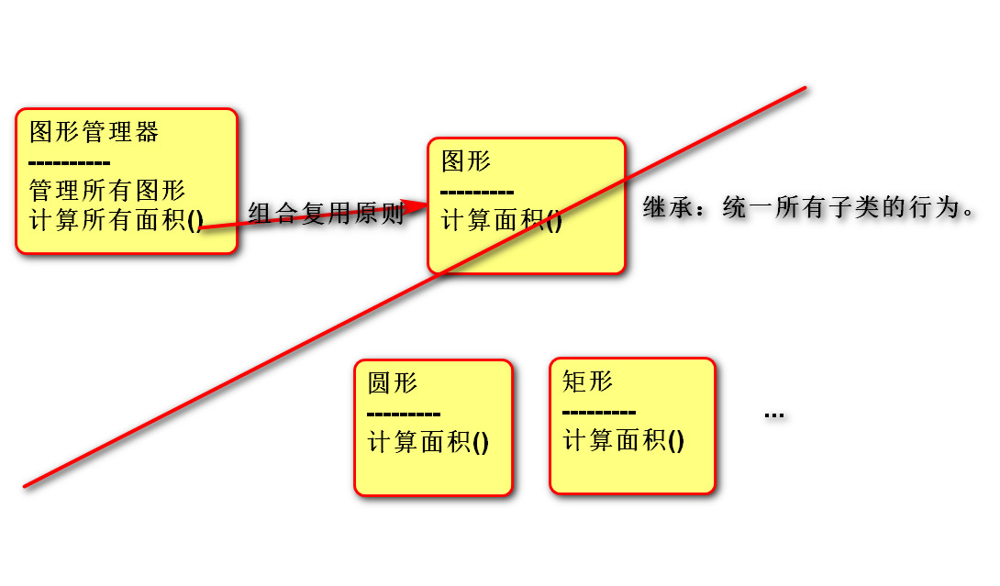
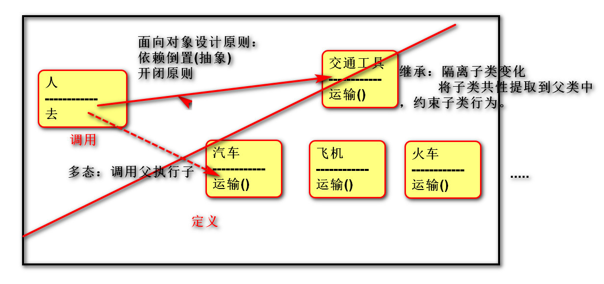

# Python 简介

## Python 定义


是一个免费、开源、跨平台、动态、面向对象的编程语言。

## Python程序的执行方式

### 交互式

> 在命令行输入指令，回车即可得到结果。

打开终端》进入交互式：python3》编写代码：print("hello world")》离开交互式：exit()

### 文件式

将指令编写到.py文件，可以重复运行程序：编写文件》打开终端》进入程序所在目录：cd 目录》执行程序： python3 文件名

## 执行过程


计算机只能识别机器码(1010)，不能识别源代码(python)。

14. 由源代码转变成机器码的过程分成两类：编译和解释。

15. 编译：在程序运行之前，通过编译器将源代码变成机器码，例如：C语言。

-- 优点：运行速度快

-- 缺点：开发效率低，不能跨平台。

16. 解释：在程序运行之时，通过解释器对程序逐行翻译，然后执行。例如Javascript

-- 优点：开发效率高，可以跨平台；

-- 缺点：运行速度慢。

17. python是解释型语言，但为了提高运行速度，使用了一种编译的方法。编译之后得到pyc文件，存储了字节码（特定于Python的表现形式，不是机器码）。

> 源代码 -- 编译 --> 字节码 -- 解释 --> 机器码

|------------1次---------|

## 解释器类型

18. CPython（C语言开发)

19. Jython (java开发)

20. IronPython (.net开发)

# 数据基本运算

## 基础知识

### pycharm常用快捷键

21. 移动到本行开头：home键

22. 移动到本行末尾：end键盘

23. 注释代码：ctrl + /

24. 复制行：ctrl +d

25. 选择列：鼠标左键 + alt

26. 移动行：shift + alt + 上下箭头

27. 智能提示：ctrl + space

28. 代码格式化：ctrl+alt+l

### 注释

> 给人看的，通常是对代码的描述信息。

29. 单行注释：以#号开头。

30. 多行注释：三引号开头，三引号结尾。

### 函数

表示一个功能，函数定义者是提供功能的人，函数调用者是使用功能的人。

例如：

31. print(数据) 作用：将括号中的内容显示在控制台中

32. 变量 = input("需要显示的内容") 作用：将用户输入的内容赋值给变量

## 变量

33. 定义：关联一个对象的标识符。

34. 命名：必须是字母或下划线开头，后跟字母、数字、下划线。

不能使用关键字(蓝色)，否则发生语法错误：SyntaxError: invalid syntax。

35. 建议命名：字母小写，多个单词以下划线隔开。

class_name

36. 赋值：创建一个变量或改变一个变量关联的数据。

37. 语法：变量名 = 数据

变量名1 = 变量名2 = 数据

变量名1, 变量名2, = 数据1, 数据2

## del 语句

38. 语法:

> del 变量名1, 变量名2

39. 作用：

> 用于删除变量,同时解除与对象的关联.如果可能则释放对象。

40. 自动化内存管理的引用计数：

> 每个对象记录被变量绑定(引用)的数量,当为0时被销毁。

## 核心数据类型

41. 在python中变量没有类型，但关联的对象有类型。

42. 通过type函数可查看。

### 空值对象 None

43. 表示不存在的特殊对象。

44. 作用：占位和解除与对象的关联。

### 整形int

45. 表示整数，包含正数、负数、0。

> 如： -5, 100, 0

46. 字面值：

> 十进制：5

二进制：0b开头，后跟1或者1

八进制：0o开头，后跟0~7

十六进制：0x开头，后跟0~9,A~F,a~f

### 浮点型float

47. 表示小数，包含正数、负数，0.0)。

48. 字面值：

- 小数：1.0 2.5

- 科学计数法：e/E (正负号) 指数

- 1.23e-2 (等同于0.0123)

- 1.23456e5(等同于123456.0)

### 字符串str

是用来记录文本信息(文字信息)。

字面值：双引号

### 复数complex

由实部和虚部组成的数字。

虚部是以j或J结尾。

字面值： 1j 1+1j 1-1j

### 布尔bool

用来表示真和假的类型

True 表示真(条件满足或成立)，本质是1

False 表示假(条件不满足或不成立)，本质是0

## 数据类型转换

49. 转换为整形: int(数据)

50. 转换为浮点型:float(数据)

51. 转换为字符串:str(数据)

52. 转换为布尔:bool(数据)

结果为False：bool(0) bool(0.0) bool(None)

53. 混合类型自动升级：

- 1 + 2.14 返回的结果是 3.14

- 1 + 3.0 返回结果是: 4.0

## 运算符

### 算术运算符

+ 加法

- 减法

* 乘法

- / 除法：结果为浮点数

- // 地板除：除的结果去掉小数部分

- % 求余

- ** 幂运算

优先级从高到低：

-  ()

- **

* / % //

+ -

### 增强运算符

y += x 等同于 y = y + x

y -= x 等同于 y = y - x

y *= x 等同于 y = y * x

y /= x 等同于 y = y / x

y //= x 等同于 y = y // x

y %= x 等同于 y = y % x

y **= x 等同于 y = y ** x

### 比较运算符

-  <		小于

- <=		小于等于

-  \>		大于

- \>=		大于等于

-  ==		等于

-  !=		不等于

返回布尔类型的值

比较运算的数学表示方式:0 <= x <= 100

### 逻辑运算符

#### 与and

表示并且的关系，一假俱假。

示例:

True and True # True

True and False # False

False and True # False

False and False # False

#### 或or

表示或者的关系，一真俱真

示例:

True or True # True

True or False # True

False or True # True

False or False # False

#### 非 not

表示取反

例如：

not True # 返回False

not False # 返回True

#### 短路运算

一但结果确定，后面的语句将不再执行。

### 身份运算符

语法:

x is y

x is not y

作用：

is 用于判断两个对象是否是同一个对象,是时返回True,否则返回False。

is not 的作用与is相反

### 优先级

高到低：

- 算数运算符

- 比较运算符

- 快捷运算符

- 身份运算符

- 逻辑运算符

# 语句

## 行

54. 物理行：程序员编写代码的行。

55. 逻辑行：python解释器需要执行的指令。

56. 建议一个逻辑行在一个物理行上。

57. 如果一个物理行中使用多个逻辑行，需要使用分号；隔开。

5. 如果逻辑行过长，可以使用隐式换行或显式换行。

隐式换行：所有括号的内容换行,称为隐式换行

括号包括: () [] {} 三种

显式换行：通过折行符 \ (反斜杠)换行，必须放在一行的末尾，目的是告诉解释器,下一行也是本行的语句。

## pass 语句

通常用来填充语法空白。

## 选择语句

### If elif else 语句

58. 作用:

让程序根据条件选择性的执行语句。

59. 语法:

if 条件1:

​	语句块1

elif 条件2:

​	语句块2

else:

​	语句块3

60. 说明:

elif 子句可以有0个或多个。

else 子句可以有0个或1个，且只能放在if语句的最后。

### if 语句的真值表达式

if 100:

​	print("真值")

等同于

if bool(100):

​	print("真值")

### 条件表达式

语法：变量 = 结果1 if 条件 else 结果2

作用：根据条件(True/False) 来决定返回结果1还是结果2。

## 循环语句

### while语句

61. 作用:

可以让一段代码满足条件，重复执行。

62. 语法:

while 条件:

​	满足条件执行的语句

else:

​	不满足条件执行的语句

63. 说明:

else子句可以省略。

在循环体内用break终止循环时,else子句不执行。

### for 语句

64. 作用:

用来遍历可迭代对象的数据元素。

可迭代对象是指能依次获取数据元素的对象，例如：容器类型。

65. 语法:

for 变量列表 in 可迭代对象:

​	语句块1

else:

​	语句块2

66. 说明:

else子句可以省略。

在循环体内用break终止循环时,else子句不执行。

### range 函数

67. 作用:

用来创建一个生成一系列整数的可迭代对象(也叫整数序列生成器)。

68. 语法:

range(开始点，结束点，间隔)

69. 说明:

函数返回的可迭代对象可以用for取出其中的元素

返回的数字不包含结束点

开始点默认为0

间隔默认值为1

## 跳转语句

### break 语句

70. 跳出循环体，后面的代码不再执行。

71. 可以让while语句的else部分不执行。

### continue 语句

跳过本次，继续下次循环。

# 容器类型

## 通用操作

### 数学运算符

72. +：用于拼接两个容器

73. +=：用原容器与右侧容器拼接,并重新绑定变量

74. *：重复生成容器元素

75. *=：用原容器生成重复元素, 并重新绑定变量

76. < <= > >= == !=：依次比较两个容器中元素,一但不同则返回比较结果。

### 成员运算符

77. 语法：

数据 in 序列

数据 not in 序列

78. 作用：

如果在指定的序列中找到值，返回bool类型。

### 索引index

79. 作用：定位单个容器元素

80. 语法：容器[整数]

81. 说明：

正向索引从0开始，第二个索引为1，最后一个为len(s)-1。

反向索引从-1开始,-1代表最后一个,-2代表倒数第二个,以此类推,第一个是-len(s)。

### 切片slice

82. 作用：

定位多个容器元素。

83. 语法：

容器[(开始索引):(结束索引)(:(步长))]

84. 说明：

小括号()括起的部分代表可省略

结束索引不包含该位置元素

步长是切片每次获取完当前元素后移动的偏移量

### 内建函数

85. len(x) 返回序列的长度

86. max(x) 返回序列的最大值元素

87. min(x) 返回序列的最小值元素

88. sum(x) 返回序列中所有元素的和(元素必须是数值类型)

## 字符串 str

### 定义

> 由一系列字符组成的不可变序列容器，存储的是字符的编码值。

### 编码

89. 字节byte：计算机最小存储单位，等于8 位bit.

90. 字符：单个的数字，文字与符号。

91. 字符集(码表)：存储字符与二进制序列的对应关系。

92. 编码：将字符转换为对应的二进制序列的过程。

93. 解码：将二进制序列转换为对应的字符的过程。

94. 编码方式：

--ASCII编码：包含英文、数字等字符，每个字符1个字节。

--GBK编码：兼容ASCII编码，包含21003个中文；英文1个字节，汉字2个字节。

--Unicode字符集：国际统一编码，旧字符集每个字符2字节，新字符集4字节。

--UTF-8编码：Unicode的存储与传输方式，英文1字节，中文3字节。

#### 相关函数

95. ord(字符串):返回该字符串的Unicode码。

96. chr(整数):返回该整数对应的字符串。

### 字面值

#### 单引和双引号的区别

97. 单引号内的双引号不算结束符

98. 双引号内的单引号不算结束符

#### 三引号作用

99. 换行会自动转换为换行符\n

100. 三引号内可以包含单引号和双引号

101. 作为文档字符串

#### 转义字符

102. 改变字符的原始含义。

> \' \" \""" \n \\ \t \0 空字符

103. 原始字符串：取消转义。

a = r"C:\newfile\test.py"

#### 字符串格式化

104. 定义：

> 生成一定格式的字符串。

105. 语法：

> 字符串%(变量)

"我的名字是%s,年龄是%s" % (name, age)

106. 类型码：

> %s 字符串 %d整数 %f 浮点数

## 列表 list

### 定义

由一系列变量组成的可变序列容器。

### 基础操作

107. 创建列表：

> 列表名 = []

列表名 = list(可迭代对象)

108. 添加元素：

> 列表名.append(元素)

列表.insert(索引，元素)

109. 定位元素：

> 列表名[索引] = 元素

变量 = 列表名[索引]

变量 = 列表名[切片] # 赋值给变量的是切片所创建的新列表

列表名[切片] = 容器 # 右侧必须是可迭代对象，左侧切片没有创建新列表。遍历列表：

正向：

for 变量名 in 列表名:

变量名就是元素

反向：

for 索引名 in range(len(列表名)-1,-1,-1):

列表名[索引名]就是元素

110. 删除元素：

> 列表名.remove(元素)

del 列表名[索引或切片]

### 深拷贝和浅拷贝

浅拷贝：复制过程中,只复制一层变量,不会复制深层变量绑定的对象的复制过程。

深拷贝：复制整个依懒的变量。

### 列表VS字符串

111. 列表和字符串都是序列,元素之间有先后顺序关系。

112. 字符串是不可变的序列,列表是可变的序列。

113. 字符串中每个元素只能存储字符,而列表可以存储任意类型。

114. 列表和字符串都是可迭代对象。

115. 函数：

> 将多个字符串拼接为一个。

result = "连接符".join(列表)

将一个字符串拆分为多个。

列表 = "a-b-c-d".split("分隔符")

### 列表推导式

116. 定义：

> 使用简易方法，将可迭代对象转换为列表。

117. 语法：

> 变量 = [表达式 for 变量 in 可迭代对象]

变量 = [表达式 for 变量 in 可迭代对象 if 条件]

118. 说明:

> 如果if真值表达式的布尔值为False,则可迭代对象生成的数据将被丢弃。

### 列表推导式嵌套

119. 语法：

> 变量 = [表达式 for 变量1 in 可迭代对象1 for 变量2 in可迭代对象2]

120. 传统写法：

result = []

for r in ["a", "b", "c"]:

for c in ["A", "B", "C"]:

result.append(r + c)

121. 推导式写法：

result = [r + c for r in list01 for c in list02]

## 元组 tuple

### 定义

122. 由一系列变量组成的不可变序列容器。

123. 不可变是指一但创建，不可以再添加/删除/修改元素。

### 基础操作

124. 创建空元组：

元组名 = ()

元组名 = tuple()

125. 创建非空元组：

元组名 = (20,)

元组名 = (1, 2, 3)

元组名 = 100,200,300

元组名 = tuple(可迭代对象)

126. 获取元素：

变量 = 元组名[索引]

变量 = 元组名[切片] # 赋值给变量的是切片所创建的新列表

127. 遍历元组：

正向：

for 变量名 in 列表名:

变量名就是元素

反向：

for 索引名 in range(len(列表名)-1,-1,-1):

元组名[索引名]就是元素

### 作用

128. 元组与列表都可以存储一系列变量，由于列表会预留内存空间，所以可以增加元素。

129. 元组会按需分配内存，所以如果变量数量固定，建议使用元组，因为占用空间更小。

130. 应用：

变量交换的本质就是创建元组：x, y = （y, x ）

格式化字符串的本质就是创建元祖："姓名:%s, 年龄:%d" % ("tarena", 15)

## 字典 dict

### 定义

131. 由一系列键值对组成的可变散列容器。

132. 散列：对键进行哈希运算，确定在内存中的存储位置，每条数据存储无先后顺序。

133. 键必须惟一且不可变(字符串/数字/元组)，值没有限制。

### 基础操作

134. 创建字典：

字典名 = {键1：值1，键2：值2}

字典名 = dict (可迭代对象)

135. 添加/修改元素：

语法:

字典名[键] = 数据

说明:

键不存在，创建记录。

键存在，修改值。

136. 获取元素：

变量 = 字典名[键] # 没有键则错误

137. 遍历字典：

for 键名 in 字典名:

​	字典名[键名]

for 键名,值名 in 字典名.items():

语句

138. 删除元素：

> del 字典名[键]

### 字典推导式

139. 定义：

使用简易方法，将可迭代对象转换为字典。

140. 语法:

{键:值 for 变量 in 可迭代对象}

{键:值 for 变量 in 可迭代对象 if 条件}

### 字典 VS 列表

141. 都是可变容器。

142. 获取元素方式不同,列表用索引,字典用键。

143. 字典的插入,删除,修改的速度快于列表。

144. 列表的存储是有序的,字典的存储是无序的。

## 集合 set

### 定义

145. 由一系列不重复的不可变类型变量(元组/数/字符串)组成的可变散列容器。

146. 相当于只有键没有值的字典(键则是集合的数据)。

### 基础操作

147. 创建空集合：

集合名 = set()

集合名 = set(可迭代对象)

148. 创建具有默认值集合：

集合名 = {1, 2, 3}

集合名 = set(可迭代对象)

149. 添加元素：

集合名.add(元素)

150. 删除元素：

集合名.discard(元素)

### 运算

151. 交集&：返回共同元素。

s1 = {1, 2, 3}

s2 = {2, 3, 4}

s3 = s1 & s2 # {2, 3}

152. 并集：返回不重复元素

s1 = {1, 2, 3}

s2 = {2, 3, 4}

s3 = s1 | s2 # {1, 2, 3, 4}

153. 补集-：返回只属于其中之一的元素

s1 = {1, 2, 3}

s2 = {2, 3, 4}

s1 - s2 # {1} 属于s1但不属于s2

补集^：返回不同的的元素

s1 = {1, 2, 3}

s2 = {2, 3, 4}

s3 = s1 ^ s2 # {1, 4} 等同于(s1-s2 | s2-s1)

154. 子集<：判断一个集合的所有元素是否完全在另一个集合中

155. 超集>：判断一个集合是否具有另一个集合的所有元素

s1 = {1, 2, 3}

s2 = {2, 3}

s2 < s1 # True

s1 > s2 # True

156. 相同或不同== !=：判断集合中的所有元素是否和另一个集合相同。

s1 = {1, 2, 3}

s2 = {3, 2, 1}

s1 == s2 # True

s1 != s2 # False

子集或相同,超集或相同 <= >=

### 集合推导式

157. 定义：

使用简易方法，将可迭代对象转换为集合。

158. 语法:

{表达式 for 变量 in 可迭代对象}

{表达式 for 变量 in 可迭代对象 if 条件}

# 函数 function

## pycharm相关设置

159. "代码自动完成"时间延时设置

> File -> Settings -> Editor -> General -> Code Completion -> Autopopup in (ms):0

160. 快捷键：

> Ctrl + P 参数信息（在方法中调用参数）

Ctrl + Q 快速查看文档

Ctrl + Alt + M 提取方法

## 定义

161. 用于封装一个特定的功能，表示一个功能或者行为。

162. 函数是可以重复执行的语句块, 可以重复调用。

## 作用

提高代码的可重用性和可维护性（代码层次结构更清晰）。

## 定义函数

163. 语法：

> def 函数名(形式参数):

  函数体

164. 说明：

> def 关键字：全称是define，意为"定义"。

函数名：对函数体中语句的描述，规则与变量名相同。

形式参数：方法定义者要求调用者提供的信息。

函数体：完成该功能的语句。

165. 函数的第一行语句建议使用文档字符串描述函数的功能与参数。

## 调用函数

166. 语法：函数名(实际参数)

167. 说明：根据形参传递内容。

## 返回值

168. 定义：

> 方法定义者告诉调用者的结果。

169. 语法：

> return 数据 

170. 说明：

> return后没有语句，相当于返回 None。

函数体没有return，相当于返回None。

## 可变／不可变类型在传参时的区别

171. 不可变类型参数有:

> 数值型(整数，浮点数,复数)

布尔值bool

None 空值

字符串str

元组tuple

固定集合frozenset

172. 可变类型参数有:

> 列表 list

字典 dict

集合 set

173. 传参说明：

> 不可变类型的数据传参时，函数内部不会改变原数据的值。

可变类型的数据传参时，函数内部可以改变原数据。

## 函数参数

### 实参传递方式argument

#### 位置传参

定义：实参与形参的位置依次对应。

#### 序列传参

定义：实参用*将序列拆解后与形参的位置依次对应。

#### 关键字传参

定义：实参根据形参的名字进行对应。

#### 字典关键字传参

174. 定义：实参用**将字典拆解后与形参的名字进行对应。

175. 作用：配合形参的缺省参数，可以使调用者随意传参。

### 形参定义方式parameter

#### 缺省参数

176. 语法：

> def 函数名(形参名1=默认实参1, 形参名2=默认实参2, ...):

函数体

177. 说明：

> 缺省参数必须自右至左依次存在，如果一个参数有缺省参数，则其右侧的所有参数都必须有缺省参数。

缺省参数可以有0个或多个，甚至全部都有缺省参数。

#### 位置形参

语法：

> def 函数名(形参名1, 形参名2, ...):

函数体

#### 星号元组形参

178. 语法：

> def 函数名(*元组形参名):

  函数体

179. 作用：

> 收集多余的位置传参。

180. 说明：

> 一般命名为'args'

形参列表中最多只能有一个

#### 命名关键字形参

181. 语法：

> def 函数名(*, 命名关键字形参1, 命名关键字形参2, ...):

函数体

def 函数名(*args, 命名关键字形参1, 命名关键字形参2, ...):
  函数体

182. 作用：

> 强制实参使用关键字传参

#### 双星号字典形参

183. 语法：

def 函数名(**字典形参名):

​		函数体

184. 作用：

收集多余的关键字传参

185. 说明:

一般命名为'kwargs'

形参列表中最多只能有一个

#### 参数自左至右的顺序

位置形参 --> 星号元组形参 --> 命名关键字形参 --> 双星号字典形参

# 作用域LEGB

186. 作用域：变量起作用的范围。

187. Local局部作用域：函数内部。

188. Enclosing 外部嵌套作用域 ：函数嵌套。

189. Global全局作用域：模块(.py文件)内部。

190. Builtin内置模块作用域：builtins.py文件。

## 变量名的查找规则

191. 由内到外：L -> E -> G -> B

192. 在访问变量时，先查找本地变量，然后是包裹此函数外部的函数内部的变量，之后是全局变量，最后是内置变量。

## 局部变量

193. 定义在函数内部的变量(形参也是局部变量)

194. 只能在函数内部使用

195. 调用函数时才被创建，函数结束后自动销毁

## 全局变量

196. 定义在函数外部,模块内部的变量。

197. 在整个模块(py文件)范围内访问（但函数内不能将其直接赋值）。

## global 语句

198. 作用：

> 在函数内部修改全局变量。

在函数内部定义全局变量(全局声明)。

199. 语法：

> global 变量1, 变量2, ...

200. 说明

> 在函数内直接为全局变量赋值，视为创建新的局部变量。

不能先声明局部的变量，再用global声明为全局变量。

## nonlocal 语句

201. 作用：

> 在内层函数修改外层嵌套函数内的变量

202. 语法

> nonlocal 变量名1,变量名2, ...

203. 说明

> 在被嵌套的内函数中进行使用

# 面向对象 Object Oriented

## 概述

### 面向过程

204. 分析出解决问题的步骤，然后逐步实现。

> 例如：婚礼筹办

-- 发请柬（选照片、措词、制作）

-- 宴席（场地、找厨师、准备桌椅餐具、计划菜品、购买食材）

-- 婚礼仪式（定婚礼仪式流程、请主持人）

205. 公式：程序 = 算法 + 数据结构

206. 优点：所有环节、细节自己掌控。

207. 缺点：考虑所有细节，工作量大。

### 面向对象

208. 找出解决问题的人，然后分配职责。

> 例如：婚礼筹办

-- 发请柬：找摄影公司（拍照片、制作请柬）

-- 宴席：找酒店（告诉对方标准、数量、挑选菜品）

-- 婚礼仪式：找婚庆公司（对方提供司仪、制定流程、提供设备、帮助执行）

209. 公式：程序 = 对象 + 交互

210. 优点

 (1) 思想层面：

-- 可模拟现实情景，更接近于人类思维。

-- 有利于梳理归纳、分析解决问题。

(2) 技术层面：

-- 高复用：对重复的代码进行封装，提高开发效率。

-- 高扩展：增加新的功能，不修改以前的代码。

-- 高维护：代码可读性好，逻辑清晰，结构规整。

211. 缺点：学习曲线陡峭。

## 类和对象

### 基础概念


212. 抽象：从具体事物中抽离出共性、本质，舍弃个别、非本质过程。

213. 类：一个抽象的概念，即生活中的"类别"。

214. 对象：类的具体实例，即归属于某个类别的"个体"。

215. 类是创建对象的"模板"。

-- 数据成员：名词类型的状态。

-- 方法成员：动词类型的行为。

### 语法

#### 定义类

216. 代码

> class 类名:

"""文档说明"""

def _init_(self,参数列表):

self.实例变量 = 参数

方法成员

217. 说明

-- 类名所有单词首字母大写.

-- _init_ 也叫构造函数，创建对象时被调用，也可以省略。

-- self 变量绑定的是被创建的对象，名称可以随意。

#### 创建对象(实例化)

变量 = 构造函数 (参数列表)

### 实例成员

#### 实例变量

218. 语法

 

(1) 定义：对象.变量名

(2) 调用：对象.变量名

219. 说明

(1) 首次通过对象赋值为创建，再次赋值为修改.

w01 = Wife()

w01.name = "建宁"

w01.name = "建宁公主"

(2) 通常在构造函数(_init_)中创建。

w01 = Wife("建宁公主,24)

print(w01.name)

(3) 每个对象存储一份，通过对象地址访问。

 

220. 作用：描述某个对象自己的数据。

221. __dict__：对象的属性，用于存储自身实例变量的字典。

#### 实例方法

222. 语法

(1) 定义： def 方法名称(self, 参数列表):

方法体

(2) 调用： 对象地址.实例方法名(参数列表)

不建议通过类名访问实例方法

223. 说明

(1) 至少有一个形参，第一个参数绑定调用这个方法的对象,一般命名为"self"。

(2) 无论创建多少对象，方法只有一份，并且被所有对象共享。

224. 作用：表示对象行为。

### 类成员

#### 类变量

225. 语法

 (1) 定义：在类中，方法外定义变量。

> class 类名:

变量名 = 表达式

(2) 调用：类名.变量名

不建议通过对象访问类变量

226. 说明

(1) 存储在类中。

(2) 只有一份，被所有对象共享。

227. 作用：描述所有对象的共有数据。

#### 类方法

228. 语法

 (1) 定义：

> @classmethod

def 方法名称(cls,参数列表):

方法体

(2) 调用：类名.方法名(参数列表)

> 不建议通过对象访问类方法

229. 说明

(1) 至少有一个形参，第一个形参用于绑定类，一般命名为'cls'

(2) 使用@classmethod修饰的目的是调用类方法时可以隐式传递类。

(3) 类方法中不能访问实例成员，实例方法中可以访问类成员。

230. 作用：操作类变量。

### 静态方法

231. 语法

 (1) 定义：

> @staticmethod

def 方法名称(参数列表):

方法体

(2) 调用：类名.方法名(参数列表)

> 不建议通过对象访问静态方法

232. 说明

> (1) 使用@ staticmethod修饰的目的是该方法不需要隐式传参数。

(2) 静态方法不能访问实例成员和类成员

233. 作用：定义常用的工具函数。

## 三大特征

### 封装


#### 数据角度讲

234. 定义：

> 将一些基本数据类型复合成一个自定义类型。

235. 优势：

将数据与对数据的操作相关联。

代码可读性更高（类是对象的模板）。

#### 行为角度讲

236. 定义：

> 类外提供必要的功能，隐藏实现的细节。

237. 优势：

> 简化编程，使用者不必了解具体的实现细节，只需要调用对外提供的功能。

238. 私有成员：

 

(1) 作用：无需向类外提供的成员，可以通过私有化进行屏蔽。

(2) 做法：命名使用双下划线开头。

(3) 本质：障眼法，实际也可以访问。

> 私有成员的名称被修改为：_类名__成员名，可以通过_dict_属性或dir函数查看。

239. 属性@property：

> 公开的实例变量，缺少逻辑验证。私有的实例变量与两个公开的方法相结合，又使调用者的操作略显复杂。而属性可以将两个方法的使用方式像操作变量一样方便。

(1) 定义：

> @property

def 属性名(self):

return self.__属性名

@属性名.setter

def 属性名(self, value):

self.__属性名= value

(2) 调用：

> 对象.属性名 = 数据

变量 = 对象.属性名

(3) 说明：

> 通常两个公开的属性，保护一个私有的变量。

@property 负责读取，@属性名.setter 负责写入

只写：属性名= property(None, 写入方法名)

#### 设计角度讲

240. 定义：

(1) 分而治之

> 将一个大的需求分解为许多类，每个类处理一个独立的功能。

(2) 变则疏之

> 变化的地方独立封装，避免影响其他类。

(3) 高 内 聚

> 类中各个方法都在完成一项任务(单一职责的类)。

(4) 低 耦 合

> 类与类的关联性与依赖度要低(每个类独立)，让一个类的改变，尽少影响其他类。

241. 优势：

便于分工，便于复用，可扩展性强。

#### 案例:信息管理系统


#### 需求

实现对学生信息的增加、删除、修改和查询。

#### 分析

> 界面可能使用控制台，也可能使用Web等等。

242. 识别对象：界面视图类 逻辑控制类 数据模型类

243. 分配职责：

> 界面视图类：负责处理界面逻辑，比如显示菜单，获取输入，显示结果等。

逻辑控制类：负责存储学生信息，处理业务逻辑。比如添加、删除等

数据模型类：定义需要处理的数据类型。比如学生信息。

244. 建立交互：

> 界面视图对象 <----> 数据模型对象 <----> 逻辑控制对象

#### 设计

数据模型类：StudentModel

数据：编号 id,姓名 name,年龄 age,成绩 score

逻辑控制类：StudentManagerController

数据：学生列表 __stu_list

行为：获取列表 stu_list,添加学生 add_student，删除学生remove_student，修改学生update_student，根据成绩排序order_by_score。

界面视图类：StudentManagerView

数据：逻辑控制对象__manager

行为：显示菜单__display_menu，选择菜单项__select_menu_item，入口逻辑main，

输入学生__input_students，输出学生__output_students，删除学生__delete_student，修改学生信息__modify_student

### 继承


#### 语法角度讲

#### 继承方法

245. 代码:

> class 父类:

def 父类方法(self):

方法体

class 子类(父类)：

def 子类方法(self):

方法体

儿子 = 子类()

儿子.子类方法()

儿子.父类方法()

246. 说明：

> 子类直接拥有父类的方法.

#### 内置函数

> isinstance(对象, 类型)

返回指定对象是否是某个类的对象。

issubclass(类型，类型)

返回指定类型是否属于某个类型。

#### 继承数据

247. **代码**

```Python
class 子类(父类):
    def __init__(self,参数列表):
    super().__init__(参数列表)
    self.自身实例变量 = 参数
```

248. **说明**

> 

  - 子类如果没有构造函数，将自动执行父类的；

```Plain Text
class Student(Person):
    # 子类若没有构造函数，使用父类的.
    pass

s01 = Student()
print(s01.name)
```

> 

  - 但如果有构造函数将覆盖父类的,此时必须通过super()函数调用父类的构造函数，以确保父类实例变量被正常创建。

```Python
class Person:
    def __init__(self,name):
        self.name = name 
        
class Student(Person):
    # 子类若具有构造函数，则必须先调用父类构造函数。
    def __init__(self,name,score):
        super().__init__(name)  # 这里调用父类的构造函数，同时需要传参的哦
        self.score = score
# 实例化测试
p01 = Person("李四")
print(p01.name)
s01 = Student("张三", 100)
print(s01.score)
print(s01.name)
```

#### 定义

> 重用现有类的功能，并在此基础上进行扩展。

说明：子类直接具有父类的成员（共性），还可以扩展新功能。

#### 优点

- 一种代码复用的方式。

#### 缺点

- 耦合度高：父类的变化，直接影响子类。

#### 设计角度讲

#### 定义

> 将相关类的共性进行抽象，统一概念，隔离变化。

#### 适用性

- 多个类在概念上是一致的，且需要进行统一的处理。

#### 相关概念

- 父类（基类、超类）、子类（派生类）。

- 父类相对于子类更抽象，范围更宽泛；子类相对于父类更具体，范围更狭小。

- 单继承：父类只有一个（例如 Java，C#）。

- 多继承：父类有多个（例如C++，Python）。

- Object类：任何类都直接或间接继承自 object 类。

#### 多继承

一个子类继承两个或两个以上的基类，父类中的属性和方法同时被子类继承下来。

同名方法的解析顺序（MRO， Method Resolution Order）:

类自身 --> 父类继承列表（由左至右）--> 再上层父类

A

/ \

/ \

B C

\ /

\ /

D

```Python
"""
    多继承 -- 语法
    同名方法解析顺序：MRO
"""

class A:
    def m01(self):
        print("A - m01")

class B(A):
    def m01(self):
        print("B - m01")

class C(A):
    def m01(self):
        print("C - m01")

class D(B,C):
    def m02(self):
        self.m01()

d01 = D()
d01.m02()

print(D.mro())# [D, B,C, A,object]
```

#### 继承练习01

**设计**

- 存在变化点的内容，不能直接调，而是要抽象一个父类出来；

- 隔离不变和变化的内容；

- 父类就是来约束子类规范的，如果按照运行来说，不写父类也是可以的，子类都写一个相同的方法也都可以满足，但是还是要用继承来规范代码编写，所以在父类中可以加一句是否继承父类的校验： `if not isinstance(damage_target, Damageable):     raise ValueError("不是Damageable的子类")`

- 父类如果有的方法，必须要子类也需要有，那就可以在父类中约定抛个异常来约定子类一定要实现重写这个父类方法：   `def damage(self, value):如果子类不重写，则异常。        raise NotImplementedError()`  这里的主要原理就是，如果子类没有写父类规定的类，那在实际调用这个子类的这个方法的时候，实际是会去找父类的方法，而此时一旦找到了父类的这个方法就知道这个子类肯定是没重写这个方法的，因为就可以报错了。

  

```Python
"""
    手雷炸了，可能伤害敌人/玩家的生命.
             还可能伤害未知事物(鸭子.房子....)
    要求：增加了新事物，不影响手雷。
    体会：继承的作用
         多态的体现
         设计原则
            开闭原则
            单一职责
            依赖倒置
    画出设计图
    15:35
"""
class Granade:
    def __init__(self, atk):
        self.atk = atk

    def explode(self, damage_target):
        # 如果传入的不是子类，则报错.
        if not isinstance(damage_target, Damageable):
            raise ValueError("不是Damageable的子类")

        print("爆炸")
        # 多态:
        # 调用父类代表(玩家/敌人.....)的可以受伤者.
        # 执类行子(具体玩家/敌人.....)
        damage_target.damage(self.atk)

class Damageable:
    """
        可以受伤
        继承:统一多个子类的概念，隔离变化。
    """

    def damage(self, value):
        # 如果子类不重写，则异常。
        raise NotImplementedError()
# ------------------------------
class Player(Damageable):
    def __init__(self, hp):
        self.hp = hp

    def damage(self, value):
        self.hp -= value
        print("玩家受伤啦")
        print("碎屏")


class Enemy(Damageable):
    def __init__(self, hp):
        self.hp = hp

    def damage2(self, value):
        self.hp -= value
        print("敌人受伤喽")
        print("头顶爆字")

g01 = Granade(100)
e01 = Enemy(200)
p01 = Player(300)
g01.explode(p01)

```

#### 继承练习02

- 子类的差异化问题子类自己解决，可以通过子类的构造方法来提供参数；

- 差异化的部分，不能找父类去要。

  

```Python
"""
    定义图形管理器类
        1. 管理所有图形
        2. 提供计算所有图形总面积的方法

    具体图形:
        圆形(pi × r ** 2)
        矩形(长*宽)
        ...

    测试：
        创建1个圆形对象，1个矩形对象，添加到图形管理器中.
        调用图形管理器的计算面积方法，输出结果。

    要求：增加新图形，不修改图形管理器的代码.
    体会：面向对象三大特征：
            封装/继承/多态
         面向对象设计原则：
            开闭/单一/倒置

"""


class GraphicManager:
    def __init__(self):
        self.__graphics = []

    def add_graphic(self, graphic):
        if isinstance(graphic, Graphic):
            self.__graphics.append(graphic)
        else:
            raise ValueError()

    def get_total_area(self):
        total_area = 0
        # 遍历图形列表，累加每个图形的面积
        for item in self.__graphics:
            # 多态：
            # 调用的是图形
            # 执行的是圆形/矩形...
            total_area += item.calculate_area()
        return total_area

class Graphic:
    def calculate_area(self):
        # 如果子类不重写，则异常.
        raise NotImplementedError()
#-----------------------------------
class Circle(Graphic):
    def __init__(self,radius):
        self.radius = radius

    def calculate_area(self):
        return 3.14 * self.radius **2


class Rectanlge(Graphic):
    def __init__(self,length,width):
        self.lenght = length
        self.width = width


    def calculate_area(self):
        return self.lenght *  self.width


c01 = Circle(5)
r01 = Rectanlge(10,20)
manager = GraphicManager()
manager.add_graphic(c01)
manager.add_graphic(r01)
re = manager.get_total_area()
print(re)
```

#### 继承练习03


```Python
"""
    定义员工管理器
        1.管理所有员工
        2. 计算所有员工工资

    员工：
        程序员：底薪 + 项目分红
        销售：底薪 + 销售额 * 0.05
        软件测试...
        ...

    要求：增加新岗位，员工管理器不变.
"""
class EmployeeManager:
    def __init__(self):
        self.__employees = []

    def add_employee(self, emp):
        self.__employees.append(emp)

    def get_total_saraly(self):
        total_saraly = 0
        for item in self.__employees:
            # 调用是抽象的员工类
            # 执行是具体的员工(程序员/销售..)
            total_saraly += item.calculate_salary()
        return total_saraly

class Employee:
    def __init__(self, base_salary):
        self.base_salary = base_salary

    def calculate_salary(self):
        return self.base_salary

# ---------------------------------------
class Programmer(Employee):
    def __init__(self, base_salary, bonus):
        super().__init__(base_salary)
        self.bonus = bonus

    def calculate_salary(self):
        # return self.base_salary + self.bonus
        # 扩展重写
        return super().calculate_salary()+ self.bonus

class Salesmen(Employee):
    def __init__(self, base_salary, sale_value):
        super().__init__(base_salary)
        self.sale_value = sale_value

    def calculate_salary(self):
        return self.base_salary + self.sale_value * 0.05

# 测试
manager = EmployeeManager()
manager.add_employee(Programmer(200000,500))
manager.add_employee(Salesmen(2000,1000))
print(manager.get_total_saraly())
```

### 多态

#### 设计角度讲

#### 定义

> 父类的同一种动作或者行为，在不同的子类上有不同的实现。

#### 作用

249. 在继承的基础上，体现类型的个性化（一个行为有不同的实现）。

250. 增强程序扩展性，体现开闭原则。

#### 语法角度讲

#### 重写

- 子类实现了父类中相同的方法（方法名、参数）。

- 在调用该方法时，实际执行的是子类的方法。调用父，执行子。

#### 快捷键

Ctrl + O

#### 内置可重写函数

Python中，以双下划线开头、双下划线结尾的是系统定义的成员。我们可以在自定义类中进行重写，从而改变其行为。

#### 转换字符串

__str__函数：将对象转换为字符串(对人友好的)

__repr__函数：将对象转换为字符串(解释器可识别的)

```Python
"""
    内置可重写函数
    练习:exercise01.py
"""
class StudentModel:
    def __init__(self, name="", age=0, score=0, id=0):
        self.name = name
        self.age = age
        self.score = score
        self.id = id

    # 对象 --> 字符串 (随意格式)
    def __str__(self):
        return "我叫%s,编号是%d,年龄是%d,成绩是:%d"%(self.name,self.id,self.age,self.score)

    # 对象 --> 字符串(解释器可识别,有格式)
    def __repr__(self):
        return "StudentModel('%s',%d,%d,%d)"%(self.name,self.age,self.score,self.id)

s01 = StudentModel("无忌",27,100,101)
str01 = str(s01)
print(str01)
print(s01)

str02 =repr(s01)
print(str02)

# 根据字符串执行python代码
re = eval("1+2*5")
# exec
print(re)

# 克隆对象
# repr 返回python格式的字符串
# eval根据字符串执行代码
s02 = eval(repr(s01))   #  通过eval 配合repr（对象）来克隆一个对象
s02.name = "老张"
print(s01.name)
```

#### 运算符重载

定义：让自定义的类生成的对象(实例)能够使用运算符进行操作。

#### 算数运算符


#### 反向算数运算符重载


#### 复合运算符重载


> 运算符重载的内容实际使用的很少，平常可能不会用，但是要知道有这个东西。

```Python
"""
    运算符重载
"""
class Vector1:
    def __init__(self, x):
        self.x = x

    def __str__(self):
        return "一维向量的分量是：" + str(self.x)

    def __add__(self, other):
        return Vector1(self.x + other)

    def __radd__(self, other):
        return Vector1(self.x + other)

    def __iadd__(self, other):
        self.x += other
        return self

v01 = Vector1(10)
print(v01 + 2)  # v01.__add__(2)

# 练习:实现自定义类的对象与数值的减法，乘法运算。
# 略...
print(2 + v01)
# 练习:实现数值与自定义类的对象的减法，乘法运算。
# 略...

print(id(v01))
# 重写__iadd__，实现在原对象基础上的变化。
# 如果重写__iadd__,默认使用__add__，一般会产生新对象.
v01 += 2
print(v01,id(v01))

# list01 = [1]
# print(id(list01))
# # 生成新对象
# re = list01 + [2]
# print(re,id(re))
# # 在原有对象基础上，累加.
# list01 += [2]
# print(list01,id(list01))
```

#### 比较运算重载


## 设计原则

### 开-闭原则（目标、总的指导思想）

**O**pen **C**losed **P**rinciple

- 对扩展开放，对修改关闭。

- **增加新功能，不改变原有代码**。允许增加新功能，但是不能改变原来代码这就是开闭原则

### 类的单一职责（一个类的定义）

**S**ingle **R**esponsibility **P**rinciple

- 一个类有且只有一个改变它的原因；发生变化的原因只能是一个那就是遵循了这个原则。

- 一个类只做一件事情；

### 依赖倒置（依赖抽象）

**D**ependency **I**nversion **P**rinciple

- 客户端代码(调用的类)尽量依赖(使用)抽象。就是使用者，调用的这个类就是客户端代码，抽象就是不具体的，就是父类，子类更具体，父类更抽象，父类就是把各个子类抽象一下。是先有子类，然后再抽象出父类，调类的时候，是调用父类，调用抽象类这样就能够实现更加稳定的逻辑。

- 抽象不应该依赖细节，细节应该依赖抽象。

- 父类约束子类在行为上保持一致

  
  
  

```Python
"""
    继承 -- 设计(2)
    练习:exercise03.py
"""
# 需求：老张开车去东北
# 变化：    坐飞机
#          坐火车
#          骑车
#          ...
class Vehicle:
    """
        交通工具,代表所有具体的交通工具(火车/飞机..)
        继承：隔离子类变化,将子类的共性(坐/飞..)提取到父类(运输)中.
    """

    def transport(self, str_position):
        # 因为父类太过于抽象，所以写不出方法体,那就直接采用pass,这个价值就是约束子类要有这个行为。
        pass

# 客户端代码，用交通工具。
class Person:
    def __init__(self, name):
        self.name = name

    def go_to(self, vehicle, str_position):
        # 多态：调用父，执行子.
        # 调用的是交通工具的运输方法
        # 执行的是飞机的运输方法或者汽车的运输方法
        vehicle.transport(str_position)

# -------以上是架构师完成的--以下是程序员完成的-----

class Car(Vehicle):
    def transport(self, str_position):
        print("汽车开到", str_position)
class Airplane(Vehicle):
    def transport(self, str_position):
        print("飞机飞到", str_position)

p01 = Person("老张")
c01 = Car()
a01 = Airplane()
p01.go_to(c01, "东北")
p01.go_to(a01, "东北")
```

### 组合复用原则（复用的最佳实践）

Composite Reuse Principle

- 如果仅仅为了代码复用优先选择组合复用，而非继承复用。

- 组合的耦合性相对继承低。

- 组合更加灵活，下面第一个图中，如果使用继承，那就成了人是手机，实际上是一种组合关系，人有一个手机；


### 里氏替换（继承后的重写，指导继承的设计）

**L**iskov **S**ubstitution **P**rinciple

父类出现的地方可以被子类替换，在替换后依然保持原功能。

子类要拥有父类的所有功能。

子类在重写父类方法时，尽量选择扩展重写，防止改变了功能。-- 下面第46行就是扩展重写，使用父类中已经有的类容再做扩展即可，而不是子类自己又重新写一个。

```Python
"""
    10:50 上课
    定义员工管理器
        1.管理所有员工
        2. 计算所有员工工资

    员工：
        程序员：底薪 + 项目分红
        销售：底薪 + 销售额 * 0.05
        软件测试...
        ...

    要求：增加新岗位，员工管理器不变.
"""
class EmployeeManager:
    def __init__(self):
        self.__employees = []

    def add_employee(self, emp):
        self.__employees.append(emp)

    def get_total_saraly(self):
        total_saraly = 0
        for item in self.__employees:
            # 调用是抽象的员工类
            # 执行是具体的员工(程序员/销售..)
            total_saraly += item.calculate_salary()
        return total_saraly

class Employee:
    def __init__(self, base_salary):
        self.base_salary = base_salary

    def calculate_salary(self):
        return self.base_salary

# ---------------------------------------
class Programmer(Employee):
    def __init__(self, base_salary, bonus):
        super().__init__(base_salary)
        self.bonus = bonus

    def calculate_salary(self):
        # return self.base_salary + self.bonus
        # 扩展重写
        return super().calculate_salary()+ self.bonus

class Salesmen(Employee):
    def __init__(self, base_salary, sale_value):
        super().__init__(base_salary)
        self.sale_value = sale_value

    def calculate_salary(self):
        return self.base_salary + self.sale_value * 0.05

# 测试
manager = EmployeeManager()
manager.add_employee(Programmer(200000,500))
manager.add_employee(Salesmen(2000,1000))
print(manager.get_total_saraly())
```

### 迪米特法则（类与类交互的原则）

Law of Demeter

不要和陌生人说话。

类与类交互时，在满足功能要求的基础上，传递的数据量越少越好。因为这样可能降低耦合度。--要调用其他类的时候，如果只使用几个方法，那就只调用其中的这几个方法即可，这样就可以先抽象一下，抽象一个父类出来，当然，这种情况也可能出现过度设计。

### 综合练习

#### 需求信息

|职业|名称|分类|法力消耗|冷却|描述|
|-|-|-|-|-|-|
|少林|少林普攻|瞬发技能|无|无|攻击单个近身敌人，对目标每秒造成100%外功攻击伤害。自动连续攻击|
|少林|罗汉棍|瞬发技能|10法力|2秒|达摩祖师所创棍法，刚猛无敌。攻击单个近身敌人，对目标造成200%外功攻击伤害|
|少林|摩诃无量|瞬发技能|50法力|8秒|少林七十二绝技之一，瞬间缩短和敌手的距离。像旋风一样挥舞武器，攻击以自身为中心半径4码范围内 的所有敌人，对每个目标造成每秒217%的外功攻击伤害。攻击持续3.9秒。|
|少林|迦叶功|瞬发技能|20法力|5秒|少林七十二绝技之一，以一条齐眉棍幻出千万棍影。向单个敌人冲锋并进行凶猛攻击，对目标造成150%外功攻击伤害|
|少林|韦陀杵|瞬发技能|20法力|10秒|少林七十二绝技之一，与大力金刚掌齐名，以浑厚内力重创敌人。重击地面，使4码内所有敌人防御降低10%，并眩晕，持续2.5秒。|
|少林|金钟罩|瞬发技能|20法力|15秒|少林七十二绝技之一，以丹田之气发出狮吼震慑敌人胆魄。开启盾墙，所有敌人对自身造成的伤害减免20%，持续10秒。|
|少林|狮吼功|瞬发技能|40法力|20秒|少林七十二绝技之一，刀枪不入。吼叫，嘲讽你附近8码范围内所有敌人，持续5秒。使你和附近8码内所有队友攻击提升15%，持续10秒。并使附近8码内所有敌人伤害降低10%，持续5秒。|
|少林|金刚伏魔|瞬发技能|100%战意|20秒|以易筋经催动少林绝技的终极奥义嘲讽全屏范围内所有敌人，挥舞武器攻击地，对全屏范围内所有敌人造成100%血上限伤害。对BOSS和PVP战斗无效。|
|逍遥|逍遥普攻|瞬发技能|||攻击6码范围内的单个敌人，对目标每秒造成100%内功攻击伤害。自动连续攻击|
|逍遥|小无相功|瞬发技能|10法力|2秒|逍遥派无上内功，鸠摩智曾以此内功催发出少林绝技拈花指来骗取六脉神剑释放电弧，击中敌人造 成200%的内功攻击伤害。|
|逍遥|祝融掌|瞬发技能|||祝融掌：出自庄子“逍遥游”，将敌方的内力化掉，并转化吸收内力汇聚于气海。喷射一条火焰攻击敌人， 每击造成每秒300%的内功攻击伤害，持续3.9秒。并使命中目标减速30%，持续3秒。|
|逍遥|北冥神功|瞬发技能|||北冥神功：李秋水除白虹掌力的另一绝学，将内力汇聚一点急剧升温后劈出。对单个目标造成120%的内功攻击 伤害，并使敌人冻结3秒|
|逍遥|寒霜怒雪|瞬发技能|||：以易经八八六十四卦为基础。按特定顺序方位进行，步法飘忽灵动。天降寒冰轰击目标区域范围内 所有敌人，造成每秒125%的内功攻击伤害，持续5秒。并使命中目标减速80%，持续5秒|
|逍遥|凌波微步|瞬发技能|||：内力凝出的冰甲，聪哑老人苏星河曾靠此招躲过丁春秋的化功大法。将你瞬间传送到前方7码的目标位置|
|逍遥|毁天灭地|瞬发技能|||：凝聚北冥真气释放的终极招式嘲讽全屏范围内所有敌人，召唤一颗巨大的陨石从天而降，引起全屏 范围内地面灼烧，对全屏范围内所有敌人造成100%血上限伤害。对BOSS和PVP战斗无效|
|丐帮|丐帮普攻|瞬发技能|无|0秒|攻击单个近身敌人，每秒造成100%内功攻击伤害，自动连续攻击|
|丐帮|飞龙在天|瞬发技能|100战意|20秒|降龙十八掌第二式，跃起半空，居高下击，威力奇大，嘲讽全屏范围内所有敌人，造成等同于其生命上限的伤 害，对BOSS和玩家无效|
|丐帮|神龙摆尾|瞬发技能|10法力|2秒|降龙十八掌第十八式，劲道奇猛，无所不辞，攻击单个近身敌人，立即造成200%内功攻击伤害，触发“御龙” 效果，使自身暴击率提升5%，持续6秒，“御龙”效果最多可叠加3次|
|丐帮|天下无狗|瞬发技能|50法力|8秒|打狗棒法的最精妙招式，八方皆棒，劲力甚广，挥动武器攻击4次，每击都会对前方5步半圆内所有敌人施加 "打狗"效果，“打狗”会在3秒内持续造成总共270%内功攻击伤害，并减速50%持续3秒|
|丐帮|醉饮江湖|瞬发技能|20法力|5秒|气运丹田，以雄厚内力将烈酒逼出，控人心窍，眩晕7步范围内单个敌人1秒，将其迅速拉至面前|
|丐帮|擒龙控鹤|瞬发技能|20法力|10秒|丐帮秘传擒拿功夫，使人失去反击之力，迷惑4步范围内所有敌人，使其无法使用技能，持续2.5秒|
|丐帮|密云不雨|瞬发技能|20法力|15秒|降龙十八掌第十三式，韬光养晦，弃攻击而全力守御，将自身50%攻击转化为防御，持续3秒|
|丐帮|亢龙有悔|瞬发技能|40法力|20秒|降龙十八掌第十一式，从至刚之中生出至柔，有余不尽，震击5步范围内所有敌人，持续造成每秒200%内功功击伤害，持续5秒|

#### 设计图

可能首先想到的是下面这种方式：（不妥当）

换一种思路：

- 文件的变化不影响功能；

- 新增新技能不修改代码；

- 某个算法改变，只修改某个类，其他类不受影响；


#### 编码

```Python
"""
    技能系统
    练习:指出下列代码哪里体现了三大特征/六大原则。

    三大特征：
        封装：将每种影响效果单独做成类.
        继承：将各种影响效果抽象为SkillImpactEffect
              隔离技能释放器与各种影响效果的变化。
        多态：各种影响效果在重写SkillImpactEffect类中impact方法.
             释放器调用SkillImpactEffect执行各种效果。
    六大原则：
        开闭原则：增加新(技能/影响效果)，不修改释放器代码.
        单一职责：SkillImpactEffect 负责 隔离变化
                 DamageEffect.. 负责定义具体的效果
                 SkillDeployer 负责释放技能
        依赖倒置：(1)释放器没有调用具体影响效果，而是调用SkillImpactEffect。
                (2)抽象的不依赖于具体的。
                  具体做法：释放器通过"依赖注入"(读取配置文件，创建影响效果对象),
                          使释放器不依赖具体影响效果.
        组合复用：释放器与影响效果是组合关系.
                可以灵活的选择各种影响效果。
        里氏替换：(1)父类出现的地方可以被子类替换
                 释放器存储影响效果列表,实际可以将各种子类存入进来.
        迪米特法则：所有类之间的耦合度都很低.
"""

class SkillImpactEffect:  # 负责 隔离变化
    """
        技能影响效果
    """

    def impact(self):
        raise NotImplementedError()

class DamageEffect(SkillImpactEffect): #负责定义具体的效果
    """
        伤害生命效果
    """

    def __init__(self, value):
        self.value = value

    def impact(self):
        print("扣你%d血" % self.value)


class LowerDeffenseEffect(SkillImpactEffect):
    """
        降低防御力
    """

    def __init__(self, value, time):
        self.value = value
        self.time = time

    def impact(self):
        print("降低%d防御力,持续%d秒" % (self.value, self.time))


class DizzinessEffect(SkillImpactEffect):
    """
        眩晕
    """

    def __init__(self, time):
        self.time = time

    def impact(self):
        print("眩晕%d秒" % self.time)


class SkillDeployer: #负责释放技能
    """
        技能释放器
    """

    def __init__(self, name):
        self.name = name
        # 加载配置文件 {技能名称:[效果1,效果2...],...}
        self.__dict_skill_config = self.__load_config_file()
        # 创建效果对象
        self.__effect_objects = self.__create_effect_objects()

    def __load_config_file(self):
        # 加载文件.....
        return {
            "降龙十八掌": ["DamageEffect(200)", "LowerDeffenseEffect(-10,5)", "DizzinessEffect(6)"],
            "六脉神剑": ["DamageEffect(100)", "DizzinessEffect(6)"]
        }

    def __create_effect_objects(self):
        # 根据name创建相应的技能对象
        #    降龙十八掌 -> ["技能1"，"技能2"]
        list_effect_name = self.__dict_skill_config[self.name]
        list_effect_object = []
        for item in list_effect_name:
            # "技能1" --> 技能1的对象
            # 对象 = eval("DamageEffect(200)")
            effect_object = eval(item)
            list_effect_object.append(effect_object)
        return list_effect_object

    # 生成技能(执行效果)
    def generate_skill(self):
        print(self.name, "技能释放啦")
        for item in self.__effect_objects:
            # 调用父类，执行子类.
            item.impact()


xlsbz = SkillDeployer("降龙十八掌")
xlsbz.generate_skill()

lmsj = SkillDeployer("六脉神剑")
lmsj.generate_skill()

```

# 程序结构

## 模块 Module

### 定义

> 包含一系列数据、函数、类的文件，通常以.py结尾。

### 作用

> 让一些相关的数据，函数，类有逻辑的组织在一起，使逻辑结构更加清晰。

有利于多人合作开发。

### 导入

#### `import` 

1. 语法：

> import 模块名

import 模块名 as 别名

2. 作用：将某模块整体导入到当前模块中

3. 使用：模块名.成员

#### `from import` 

4. 语法：

> from 模块名 import 成员名[ as 别名1]

5. 作用：将模块内的一个或多个成员导入到当前模块的作用域中。

6. 使用：直接使用成员名

#### `from import \*` 

7. 语法：from 模块名 import *

8. 作用：将某模块的所有成员导入到当前模块。

9. **模块中以下划线(_)开头的属性，不会被导入，通常称这些成员为隐藏成员。**--直接通过import  * 的时候就不会导入隐藏成员，但是通过from  XX import _func   这种是可以的，毕竟你指名道姓就要用这个，也是可以的。

10. **需要注意，导入进来的成员不要和当前模块中的成员冲突**，也要防止与其他模块之间冲突，如果有冲突的也可以用as来定义别名

### 模块变量

**__all__变量：定义可导出成员，仅对from xx import *语句有效。**

__doc__变量：文档字符串。

__file__变量：模块对应的文件路径名。

**__name__变量：模块自身名字，可以判断是否为主模块。**

当此模块作为主模块(第一个运行的模块)运行时，__name__绑定'__main__'，不是主模块，而是被其它模块导入时,存储模块名。

```Python
"""
    模块相关概念
"""
# from module01 import *
#
# fun01()
# # 1. 隐藏成员，不能通过from 模块 import × 形式导入
# _fun02()
# from module01 import _fun02
#
# # 隐藏成员，可以通过其他形式调用
# _fun02()

# 2. 通过__all__指定可导出成员
from module01 import *

MyClass.fun03()
_fun02()

# 3.可以通过该属性，查看文档注释
print(__doc__)

# 4.返回当前模块的绝对路径（从系统根目录开始计算的）
print(__file__)

# 5.
# 现象：
# 主模块叫做：__main__
# 非主模块叫做：真名
print(__name__)
# 作用1： 不是主模块不执行。(测试代码)
# 作用2： 只有是主模块才执行。(主模块代码)
# 使用：
if __name__ == "__main__":
    pass
```

### 加载过程

> 在模块导入时，模块的所有语句会执行。

如果一个模块已经导入，则再次导入时不会重新执行模块内的语句。

### 分类

11. 内置模块(builtins)，在解析器的内部可以直接使用。

12. 标准库模块，安装Python时已安装且可直接使用。

13. 第三方模块（通常为开源），需要自己安装。

14. 用户自己编写的模块（可以作为其他人的第三方模块）

## 包package

### 定义

将模块以文件夹的形式进行分组管理。

### 作用

> 让一些相关的模块组织在一起，使逻辑结构更加清晰。

```Python
"""
    包

python程序结构
    文件夹  ---- 项目根目录
        包
            模块
                类
                    函数
                        语句
    练习：my_project
"""

# # form 包.模块 import 成员
# from package01.module_a import fun01
# fun01()
#
# form 包.包.模块 import 成员
from package01.package02.module_b import fun02
fun02()

# import package01.module_a as pm
# pm.fun01()
```

### 导入

> import 包名.模块名 [as 模块新名]

import 包名.子包名.模块名 [as 模块新名]

from 包名 import 模块名 [as 模块新名]

from 包名.子包名 import 模块名 [as 模块新名]

from 包名.子包名.模块名 import 成员名 [as 属性新名]

# 导入包内的所有子包和模块

from 包名 import *

from 包名.模块名 import *

### __init__.py 文件

> 是包内必须存在的文件

会在包加载时被自动调用

#### __all__

记录from 包 import * 语句需要导入的模块

案例：

15. 根据下列结构，创建包与模块。

> my_ project /

main.py

common/

__init__.py

list_helper.py

skill_system/

__init__.py

skill_deployer.py

skill_manager.py

16. 在main.py中调用skill_manager.py中实例方法。

17. 在skill_manager.py中调用skill_deployer.py中实例方法。

18. 在skill_deployer.py中调用list_helper.py中类方法。

### 搜索顺序

> 内置模块

sys.path 提供的路径

```Python

print("common -- list_helper")

import sys
# 如果不再pycharm中运行当前模块，则导包失败.
# 将项目根目录加入path中，导包才会成功.
sys.path.append("/home/tarena/1905/month01/code/day15/my_project")  # 在导包失败的时候，可以手动添加项目根目录添加到路径列表中
print(sys.path)

from main import *

main_fun01()

```

# 异常处理Error

## 异常

19. 定义：运行时检测到的错误。

20. 现象：当异常发生时，程序不会再向下执行，而转到函数的调用语句。

21. 常见异常类型：

> -- 名称异常(NameError)：变量未定义。

-- 类型异常(TypeError)：不同类型数据进行运算。

-- 索引异常(IndexError)：超出索引范围。

-- 属性异常(AttributeError)：对象没有对应名称的属性。

-- 键异常(KeyError)：没有对应名称的键。

-- 为实现异常(NotImplementedError)：尚未实现的方法。

-- 异常基类Exception。

## 处理

22. 语法：

> try:

可能触发异常的语句

except 错误类型1 [as 变量1]：

处理语句1

except 错误类型2 [as 变量2]：

处理语句2

except Exception [as 变量3]：

不是以上错误类型的处理语句

else:

未发生异常的语句

finally:

无论是否发生异常的语句

23. 作用：将程序由异常状态转为正常流程。

24. 说明：

> as 子句是用于绑定错误对象的变量，可以省略

except子句可以有一个或多个，用来捕获某种类型的错误。

else子句最多只能有一个。

finally子句最多只能有一个，如果没有except子句，必须存在。

如果异常没有被捕获到，会向上层(调用处)继续传递，直到程序终止运行。

## raise 语句

25. 作用：抛出一个错误，让程序进入异常状态。

26. 目的：在程序调用层数较深时，向主调函数传递错误信息要层层return 比较麻烦，所以人为抛出异常，可以直接传递错误信息。。

## 自定义异常

27. 定义：

> class 类名Error(Exception):

def __init__(self,参数):

super().__init__(参数)

self.数据 = 参数

28. 调用：

> try:

....

raise 自定义异常类名(参数)

....

except 定义异常类 as 变量名:

变量名.数据

29. 作用：封装错误信息

#### 综合使用异常处理练习：

```Python
"""
    界面代码
"""
from bll import *
from model import *

class StudentManagerView:
    """
    学生管理器视图
    """

    def __init__(self):
        self.__manager = StudentManagerController()

    def __display_menu(self):
        print("1)添加学生")
        print("2)显示学生")
        print("3)删除学生")
        print("4)修改学生")
        print("5)按照成绩升序显示学生")

    def __select_menu(self):
        item = input("请输入：")
        if item == "1":
            self.__input_student()
        elif item == "2":
            self.__output_students(self.__manager.stu_list)
        elif item == "3":
            self.__delete_student()
        elif item == "4":
            self.__modify_student()
        elif item == "5":
            self.__output_student_by_score()

    def main(self):
        """
            界面视图入口
        :return:
        """
        while True:
            self.__display_menu()
            self.__select_menu()

    def __input_number(self,message):
        while True:
            try:
                number = int(input(message))
                return number
            except:
                print("输入有误")

    def __input_student(self):
        name = input("请输入姓名：")
        # age = int(input("请输入年龄："))
        # score = int(input("请输入成绩："))
        age = self.__input_number("请输入年龄：")
        score = self.__input_number("请输入成绩：")
        stu = StudentModel(name, age, score)
        self.__manager.add_student(stu)

    def __output_students(self, list_output):
        for item in list_output:
            print(item.id, item.name, item.atk, item.score)

    def __delete_student(self):
        # id = int(input("请输入编号："))
        id = self.__input_number("请输入编号：")

        if self.__manager.remove_student(id):
            print("删除成功")
        else:
            print("删除失败")

    def __modify_student(self):
        stu = StudentModel()
        # stu.id = int(input("请输入需要修改的学生编号:"))
        stu.id = self.__input_number("请输入需要修改的学生编号:")
        stu.name = input("请输入新的学生名称：")
        # stu.atk = int(input("请输入新的学生年龄："))
        # stu.score = int(input("请输入新的学生成绩："))
        stu.atk = self.__input_number("请输入新的学生年龄:")
        stu.score = self.__input_number("请输入新的学生成绩：")

        if self.__manager.update_student(stu):
            print("修改成功")
        else:
            print("修改失败")

    def __output_student_by_score(self):
        self.__manager.order_by_score()
        self.__output_students(self.__manager.stu_list)
```

# 迭代

每一次对过程的重复称为一次"迭代"，而每一次迭代得到的结果会作为下一次迭代的初始值。例如：循环获取容器中的元素。

## 可迭代对象iterable 

30. 定义：具有__iter__函数的对象，可以返回迭代器对象。

31. 语法

> -- 创建：

class 可迭代对象名称:

  def __iter__(self):

      return 迭代器

-- 使用：

for 变量名 in 可迭代对象:

语句

32. 原理：

> 迭代器 = 可迭代对象.__iter__()

while True:

try:

print(迭代器.__next__())

except StopIteration:

break

```Python
# 练习2:不使用for，获取字典所有数据。
#  {"铁扇公主":101,"铁锤公主":102,“扳手王子”:103}
# 10:40

dict01 = {"铁扇公主": 101, "铁锤公主": 102, "扳手王子": 103}

iterator = dict01.__iter__()  # 存的就是迭代器，迭代器就有__next__ 方法
while True:
    try:
        key = iterator.__next__()
        print(key, dict01[key])
    except StopIteration:  # 取不到为止，就会抛出StopIteration异常，所以捕获后退出循环即可
        break
```

## 迭代器对象iterator

33. 定义：可以被next()函数调用并返回下一个值的对象。

34. 语法

> class 迭代器类名:

def __init__(self, 聚合对象):

self.**聚合对象**= 聚合对象

def __next__(self):

if 没有元素:

raise StopIteration

return 聚合对象元素


手写迭代器对象：

```Python
"""
    迭代器
    练习:exercise03.py
"""


class Skill:
    pass


class SkillManager:
    """
        技能管理器  可迭代对象
    """

    def __init__(self):
        self.__skills = []

    def add_skill(self, skill):
        self.__skills.append(skill)

    def __iter__(self):
        # 创建一个迭代器对象,并传递需要迭代的数据。
        return SkillIterator(self.__skills)

class SkillIterator:  # 创建一个迭代器，其需要有一个__next__方法和一个取值到最后抛出异常的一个方法
    """
        技能迭代器
    """

    def __init__(self, target):
        self.__target = target
        self.__index = 0

    def __next__(self):
        # 如果没有数据了，则抛出异常
        if self.__index > len(self.__target) - 1:
            raise StopIteration

        # 返回下一个数据
        temp = self.__target[self.__index]
        self.__index += 1
        return temp

manager = SkillManager()
manager.add_skill(Skill())
manager.add_skill(Skill())
manager.add_skill(Skill())

for item in manager:
    print(item)

iterator = manager.__iter__()
while True:
    try:
        item = iterator.__next__()
        print(item)
    except StopIteration:
        break
```

图形迭代器

```Python
# 练习：图形管理器记录多个图形
#      迭代图形管理器对象
class Graphic:
    pass

class GraphicManager:
    """
        图形管理器，可迭代对象(参与for)
    """
    def __init__(self):
        self.__graphics = []

    def add_graphic(self, graphic):
        self.__graphics.append(graphic)

    def __iter__(self):
        return GraphicIterator(self.__graphics)

class GraphicIterator:
    """
        图形迭代器（获取下一个数据）
    """
    def __init__(self, target):
        self.__target = target
        self.__index = 0

    def __next__(self):
        if self.__index > len(self.__target) - 1:
            raise StopIteration
        temp = self.__target[self.__index]
        self.__index += 1
        return temp
manager = GraphicManager()
manager.add_graphic(Graphic())
manager.add_graphic(Graphic())
manager.add_graphic(Graphic())
# for item in manager:
#     print(item)
iterator = manager.__iter__()
while True:
    try:
        item = iterator.__next__()
        print(item)
    except StopIteration:
        break
```

35. 说明：

> -- 聚合对象通常是容器对象。

4. 作用：使用者只需通过一种方式，便可简洁明了的获取聚合对象中各个元素，而又无需了解其内部结构。

# 生成器generator

36. 定义：能够动态(循环一次计算一次返回一次)提供数据的可迭代对象。

37. 作用：在循环过程中，按照某种算法推算数据，不必创建容器存储完整的结果，从而节省内存空间。数据量越大，优势越明显。

38. 以上作用也称之为**延迟操作或惰性操作**，通俗的讲就是在需要的时候才计算结果，而不是一次构建出所有结果。

## 生成器函数

39. 定义：含有**yield**语句的函数，返回值为生成器对象。-- 生成器=可迭代对象+迭代器

40. 语法

```Python
# 创建：
def 函数名():
            ...
            yield 数据
            ...
# 调用：
for 变量名 in 函数名():
        语句
```

41. 说明：

> -- 调用生成器函数将返回一个生成器对象，不执行函数体。

-- yield翻译为"产生"或"生成"

42. 执行过程：

 (1) 调用生成器函数会自动创建迭代器对象。

(2) 调用迭代器对象的__next__()方法时才执行生成器函数。

(3) 每次执行到yield语句时返回数据，暂时离开。

(4) 待下次调用__next__()方法时继续从离开处继续执行。

 原理：生成迭代器对象的大致规则如下

> -- 将yield关键字以前的代码放在next方法中。

  - 以后在需要拿到多个同类对象的时候，可以使用yield来处理

-- 将yield关键字后面的数据作为next方法的返回值。

```Python
"""
    yield --> 生成器
    练习:exercise07.py
"""
"""
class MyRange:
    def __init__(self, stop_value):
        self.stop_value = stop_value

    def __iter__(self):
        number = 0
        while number < self.stop_value:
            yield number
            number += 1

my01 = MyRange(10)

iterator = my01.__iter__()
while True:
    try:
        item = iterator.__next__()
        print(item)
    except StopIteration:
        break
"""

"""
# 生成器原理
class MyGenerator:
    # 生成器 = 可迭代对象 + 迭代器
    def __init__(self,stop_value):
        self.begin = 0
        self.stop_value = stop_value
        
    def __iter__(self):
        return self

    def __next__(self):
        if self.begin >= self.stop_value:
            raise StopIteration
            
        temp = self.begin
        self.begin+=1
        return temp
"""
def my_range(stop_value):
    number = 0
    while number < stop_value:
        yield number
        number += 1

my01 = my_range(10)
print(type(my01), dir(my01))# dir 获取对象所有成员

print(id(my01.__iter__()), id(my01))

for item in my01:
    print(item)
```

## 内置生成器

### 枚举函数enumerate

44. 语法：

> for 变量 in enumerate(可迭代对象):

语句

for 索引, 元素in enumerate(可迭代对象):

语句

45. 作用：遍历可迭代对象时，可以将索引与元素组合为一个元组。

### zip

46. 语法：

> for item in zip(可迭代对象1, 可迭代对象2....):

语句

47. 作用：将多个可迭代对象中对应的元素组合成一个个元组，生成的元组个数由最小的可迭代对象决定。

## 生成器表达式

48. 定义：用推导式形式创建生成器对象。

49. 语法：变量 = ( 表达式 for 变量 in 可迭代对象 [if 真值表达式] )

```Python
# 练习:1. 获取列表中所有字符串
#     2. 获取列表中所有小数
# 要求:分别使用生成器函数/生成器表达式/列表推导式完成.
list01 = [3, "54", True, 6, "76", 1.6, False, 3.5]
# 练习:1
def find01():
    for itme in list01:
        if type(itme) == str:
            yield itme

re = find01()
for item in re:
    print(item)

re = (itme for itme in list01 if type(itme) == str)
for item in re:
    print(item)

re = [itme for itme in list01 if type(itme) == str]
for item in re:
    print(item)

# 练习:2
def find02():
    for itme in list01:
        if type(itme) == float:
            yield itme

for item in find02():
    print(item)

for item in (item for item in list01 if type(item) == float):
    print(item)

for item in [item for item in list01 if type(item) == float]:
    print(item)
```

# 函数式编程

1. 定义：用一系列函数解决问题。

> -- 函数可以赋值给变量，赋值后变量绑定函数。

-- 允许将函数作为参数传入另一个函数。

-- 允许函数返回一个函数。

2. 高阶函数：将函数作为参数或返回值的函数。

## 函数作为参数

> 将核心逻辑传入方法体，使该方法的适用性更广，体现了面向对象的开闭原则。

```Python
"""

"""
# 1. 使用生成器函数实现以上3个需求
# 2. 体会函数式编程的"封装"
#    将三个函数变化点提取到另外三个函数中.
#    将共性提取到另外一个函数中
# 3. 体会函数式编程的"继承"与"多态"
#    使用变量隔离变化点,在共性函数中调用变量.
# 4. 测试(执行上述功能)

list01 = [43, 4, 5, 5, 6, 7, 87]

# 需求1:在列表中查找所有偶数
def find01():
    for item in list01:
        if item % 2 == 0:
            yield item

# 需求2:在列表中查找所有大于10的数
def find02():
    for item in list01:
        if item > 10:
            yield item

# 需求3:在列表中查找所有范围在10--50之间的数
def find03():
    for item in list01:
        if 10 < item < 50:
            yield item

# "封装"
def condition01(item):
    return item % 2 == 0

def condition02(item):
    return item > 10

def condition03(item):
    return 10 < item < 50

# "继承"
def find(func_condition):
    for item in list01:
        # "多态"
        # 调用:具体条件的抽象
        # 执行:具体条件的函数
        if func_condition(item):
            yield item

for item in find(condition02):
    print(item)

# 方法参数,如果传递10/"张无忌"/True,叫做传递数据
# 方法参数,如果函数1/函数2/函数3,叫做传递逻辑
# 15:35
```

### lambda 表达式

50. 定义：是一种匿名方法。

51. 作用：作为参数传递时语法简洁，优雅，代码可读性强。

> 随时创建和销毁，减少程序耦合度。

52. 语法

> -- 定义：

变量 = lambda 形参: 方法体

-- 调用：

变量(实参)

53. 说明：

> -- 形参没有可以不填

-- 方法体只能有一条语句，且不支持赋值语句。

### 内置高阶函数

54. map（函数，可迭代对象）：使用可迭代对象中的每个元素调用函数，将返回值作为新可迭代对象元素；返回值为新可迭代对象。

55. filter(函数，可迭代对象)：根据条件筛选可迭代对象中的元素，返回值为新可迭代对象。

56. sorted(可迭代对象，key = 函数,reverse = bool值)：排序，返回值为排序结果。

57. max(可迭代对象，key = 函数)：根据函数获取可迭代对象的最大值。

58. min(可迭代对象，key = 函数)：根据函数获取可迭代对象的最小值。

## 函数作为返回值

> 逻辑连续，当内部函数被调用时，不脱离当前的逻辑。

### 闭包

59. 三要素：

> -- 必须有一个内嵌函数。

-- 内嵌函数必须引用外部函数中变量。

-- 外部函数返回值必须是内嵌函数。

60. 语法

> -- 定义：


```Python
def 外部函数名(参数):
	外部变量
    def 内部函数名(参数):
    使用外部变量
    return 内部函数名
```

-- 调用：

变量 = 外部函数名(参数)

变量(参数)

61. 定义：在一个函数内部的函数,同时内部函数又引用了外部函数的变量。

62. 本质：闭包是将内部函数和外部函数的执行环境绑定在一起的对象。

63. 优点：内部函数可以使用外部变量。

64. 缺点：外部变量一直存在于内存中，不会在调用结束后释放，占用内存。

65. 作用：实现python装饰器。

### 函数装饰器decorator

> 闭包的应用就是装饰器

66. 定义：在不改变原函数的调用以及内部代码情况下，为其添加新功能的函数。

67. 语法

def 函数装饰器名称(func):

​		def 内嵌函数(*args, **kwargs):

​				需要添加的新功能

​				return func(*args, **kwargs)

​		return内嵌函数

原函数 = 内嵌函数

> @ 函数装饰器名称

def 原函数名称(参数):

函数体

原函数(参数)

68. 本质：使用"@函数装饰器名称"修饰原函数，等同于创建与原函数名称相同的变量，关联内嵌函数；故调用原函数时执行内嵌函数。

原函数名称 = 函数装饰器名称（原函数名称）

69. 装饰器链：

> 一个函数可以被多个装饰器修饰，执行顺序为从近到远。

```Python
"""
    闭包
"""
def fun01():
    a = 1
    def fun02():
        print(a)
    return fun02
# 调用外部函数，返回值是内嵌函数
result = fun01()
# 调用内嵌函数
result()  # 可以访问外部变量a
# 闭包应用:逻辑连续，当内部函数被调用时，不脱离当前的逻辑
# 压岁钱
def give_gife_money(money):
    """
        得到压岁钱
    :return:
    """
    print("得到了%d压岁钱" % money)

    def child_buy(target, price):
        """
            孩子购买商品
        :param target: 需要购买的商品
        :param price: 商品单价
        """
        nonlocal money
        if money >= price:
            money -= price
            print("孩子花了%.1f钱，购买了%s" % (price, target))
        else:
            print("钱不够啦")

    return child_buy

# 下列代码是一个连续的逻辑
action = give_gife_money(10000)
action("唐僧肉", 0.5)
action("小汽车", 2000)
action("手机", 8000)
```

