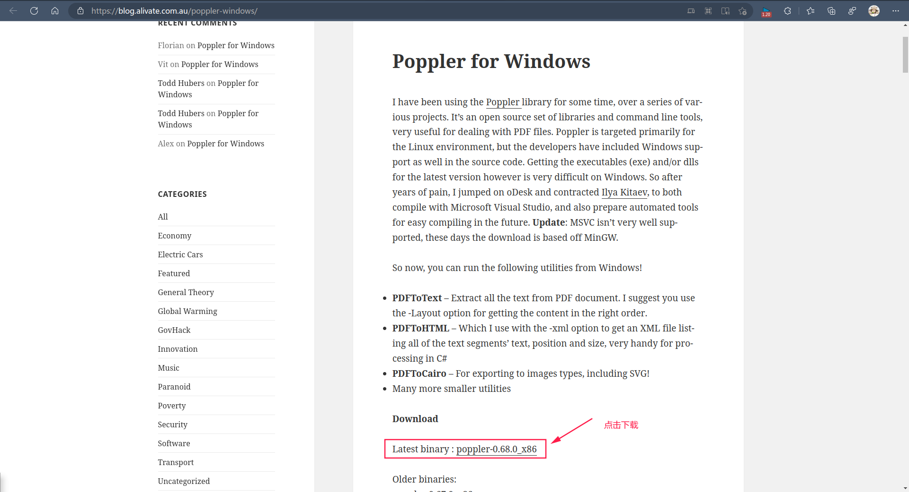
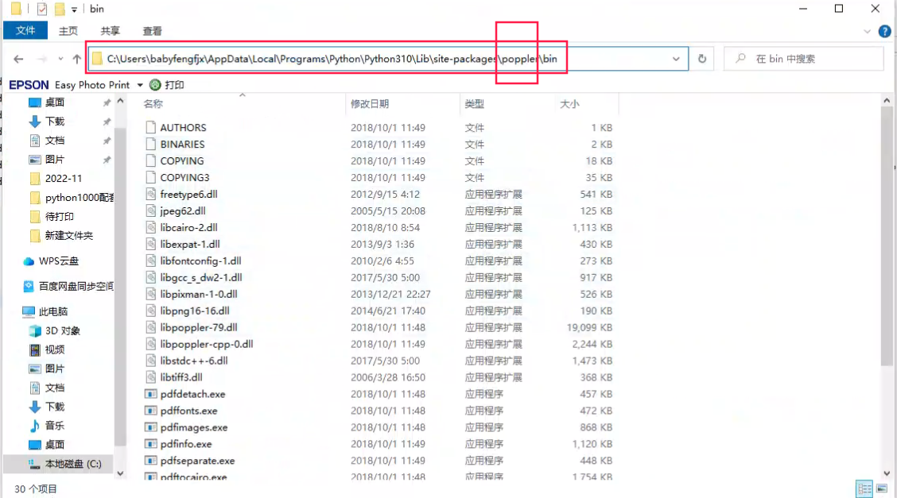
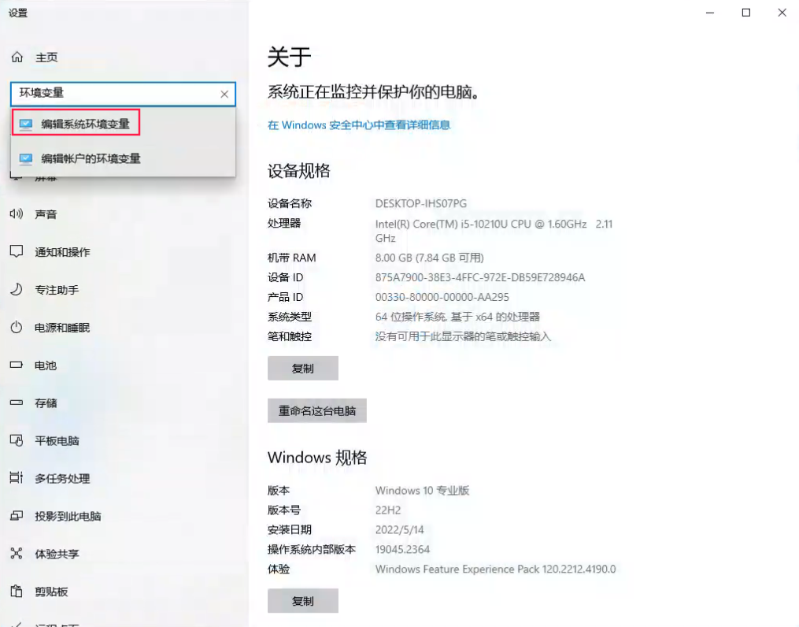
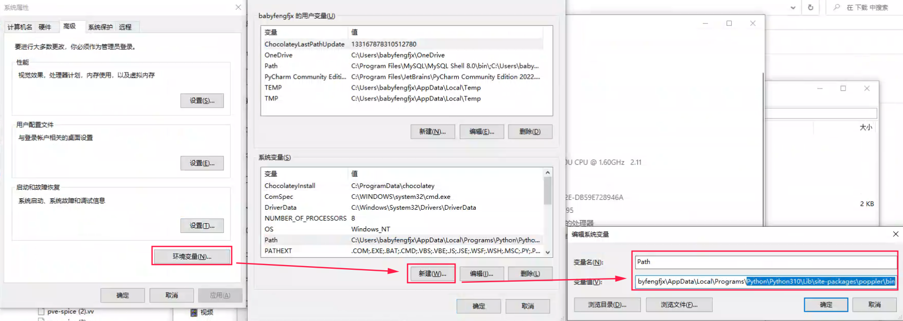

## linux上使用

直接安装：

```shell
pip3 install pdf2image
```

几行代码搞定：

```python
from pdf2image import convert_from_path

# 将 PDF 文件转换为 JPEG 格式的图像文件
images = convert_from_path('ISO291195.pdf', dpi=300, fmt='jpeg')  # 主要是用convert_from_path来处理，得到的images对象可以直接调用save来保存图片的

# 保存图像文件
for i, image in enumerate(images):
    image.save('images/output_{}.jpg'.format(i)) # 这里就是依次调用上面得到的对象来调用save方法转成图片
```

## windows上使用

> windows上使用时，在安装阶段遇到了问题，主要是在安装完`pdf2image`后，运行程序报错了：```pdf2image.exceptions.PDFInfoNotInstalledError: Unable to get page count. Is poppler installed and in PATH?```

这个主要是因为poppler库未正常安装导致的，可以按照如下方式来安装配置poppler：

### step1：下载文件

[点击下载](https://blog.alivate.com.au/poppler-windows/)



### step2：解压

将文件解压到你想放置的路径下，如下图，我将poppler文件夹直接放到了python的site-packages目录下了：



### step3：配置环境变量

直接在设置中搜索即可：



将刚放置poppler文件夹的路径进入到`bin`目录，然后复制整个路径信息，新建`Path`变量，如下图所示：



### step4:重启系统

重启系统后再次执行程序就会正常了。

