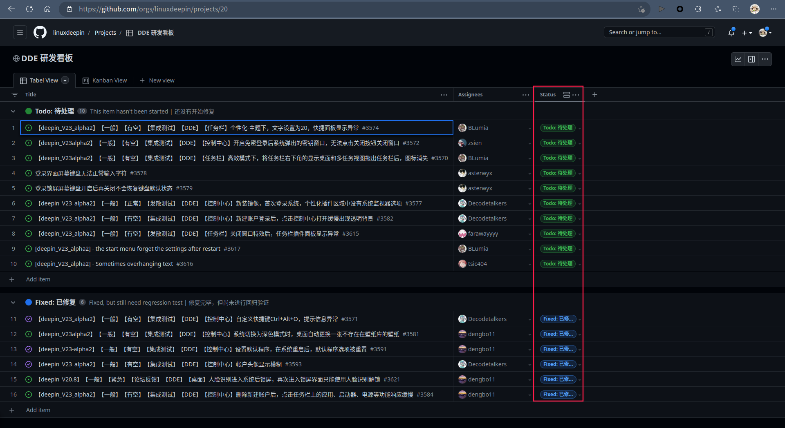
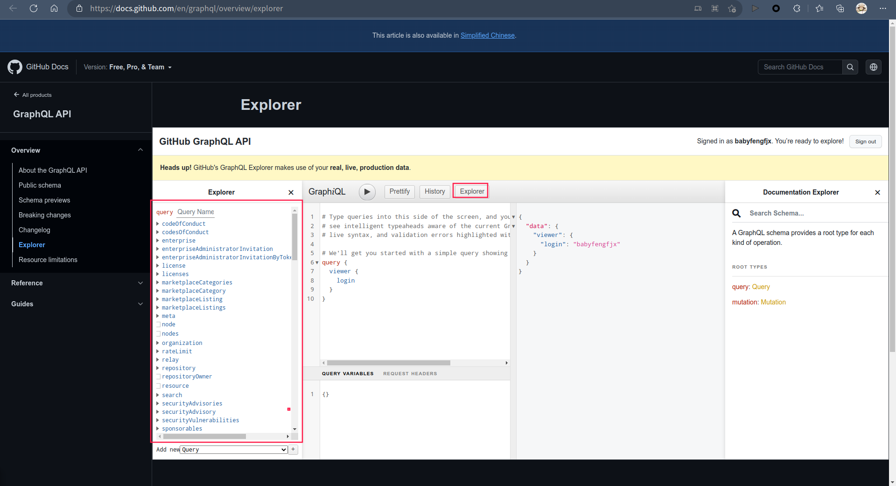
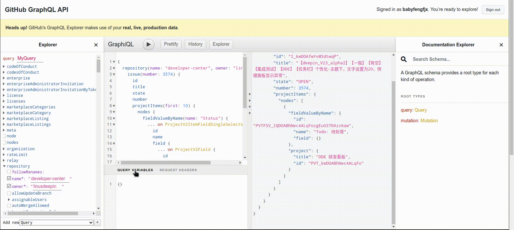

## 背景

> - 最近公司的bug和需求都转移到github处理了，因github上issue的状态非常少，只有open和close，无法体现bug流转的中间状态，所以研发又创建了看板，在github看板上可以自定义对应issue的状态信息。
> - 因之前已经将禅道的bug信息全部同步到了明道云，我们对bug的监控都是在明道云开展，这次新增了一个github就分散了工作平台，会导致工作效率的降低，因此需要将github上的数据实时同步到明道云，与禅道上的数据一同展示。
> - 当前已经将issue的相关状态同步到明道云了，但是issue在看板中的状态却没有顺利获取到，主要是因为github对project的管理API更换成了GraphQL方式，因不太清楚查询方法，所以就有了下文的探索过程。
> - 想要获取的状态信息如下：

## 了解GraphQL

[详情可以访问官网](https://graphql.cn/)

我的理解就是这种API的方式特别牛皮，在以前前后端需要反复查询的过程可以一步到位，比如以前要先通过A接口获取某某ID，然后通过ID再通过B接口获取某某信息，然后再通过这个信息从C接口获取想要数据，而且返回的数据是一大堆，再从这一大堆中去捞自己想要的内容，而这个graphql就牛在，不论是多少次嵌套查询关联查询，都能一步到位，一个请求解决，想要哪个字段就只跟你返回哪个字段，也就是不多不少，效率提升了，容量还减少了，而且兼容性也好，新增变更字段都不影响。

> 反正这个查询是真的不会用，为了找这个project中的issue状态都玩了一天多，才通过github提供的工具帮忙解决了查询的语句写法。

## 查询操作

通过[github提供的工具](https://docs.github.com/en/graphql/overview/explorer)可以方便的调试查询：



上述截图就是github提供的工具，可以快速的在左侧列中点击选择自己想要查询的字段，实际上这些字段和对象的定义还是比较难懂，可以通过官方提供的接口文档找找对应有用的信息，[projects相关接口文档](https://docs.github.com/en/issues/planning-and-tracking-with-projects/automating-your-project/using-the-api-to-manage-projects)。

通过左边的对象不断的尝试，最终可以通过仓库》issue》project这个级别依次寻找到想要的内容：

- 其中粉红色部分是可筛选的字段，最终就是需要传递issue编号来查询其在看板中的状态的。




## 编码实现请求

通过上面的尝试，最终获取到了查询语句的内容为：

```sql
{
                          repository(name: "developer-center", owner: "linuxdeepin") {
                            issue(number: %d) {
                              state
                              number
                              projectItems(first: 2) {
                                nodes {
                                  fieldValueByName(name: "Status") {
                                    ... on ProjectV2ItemFieldSingleSelectValue {
                                      name
                                      field {
                                        ... on ProjectV2Field {
                                          name
                                        }
                                      }
                                    }
                                  }
                                  project {
                                    title
                                    id
                                  }
                                }
                              }
                            }
                          }
                        }
```

需要用python中的request模块来请求，实际上在传递参数的时候也比较简单，直接通过`json=`的方式来传递参数即可，因具体的issue编号是要通过传参的，所以代码实现如下：

```python
import requests
def getissue_status(issueid):
    url = 'https://api.github.com/graphql'  #接口请求地址
    headers = {
        'Accept': 'application/vnd.github+json',
        'Authorization': 'Bearer ghp_xxxxxx',  # 这个token在你的设置》开发设置中去设置即可
    }
    querypayload = """{
                          repository(name: "developer-center", owner: "linuxdeepin") {
                            issue(number: %d) {   
                              state
                              number
                              projectItems(first: 2) {
                                nodes {
                                  fieldValueByName(name: "Status") {
                                    ... on ProjectV2ItemFieldSingleSelectValue {
                                      name
                                      field {
                                        ... on ProjectV2Field {
                                          name
                                        }
                                      }
                                    }
                                  }
                                  project {
                                    title
                                    id
                                  }
                                }
                              }
                            }
                          }
                        }
    """ %(issueid)     # 这里传参不能用f"{}"模式，就改用%d 占位，然后通过%()来传递
    try:
        res = requests.post(url,headers=headers,json={"query":querypayload}).json()
        status = res["data"]["repository"]['issue']["projectItems"]["nodes"][0]["fieldValueByName"]["name"]
        project_id = res["data"]["repository"]['issue']["projectItems"]["nodes"][0]['project']['id']   # id : PVT_kwDOABhNec4ALqFo
        if project_id == 'PVT_kwDOABhNec4ALqFo':  # 限定在这一个看板中的issue则进行统计
            print(status)

    except IndexError as e:  # 因为不是所有issue都有看板，所以此处需要作一下异常处理
        print(e)
        print('')
```

通过上面的方式就可以顺利获得issue在看板中的状态了，感觉最复杂的部分就是如何获取查询语句了，这部分还是没有太明白，只能先解决问题，日后有需求再作进一步学习。


