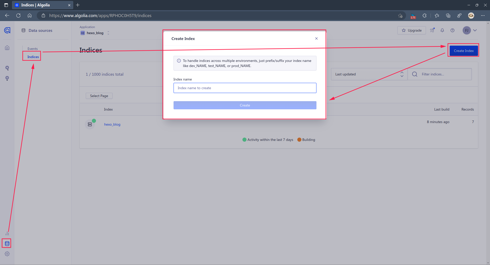
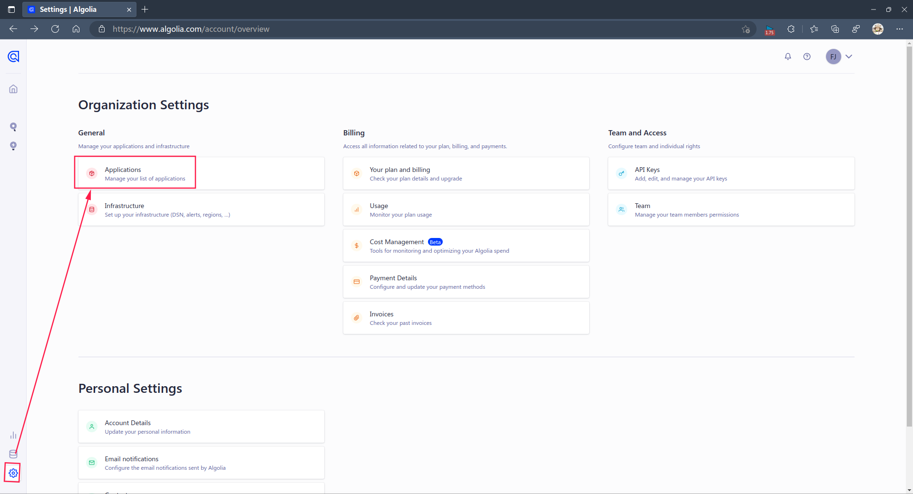
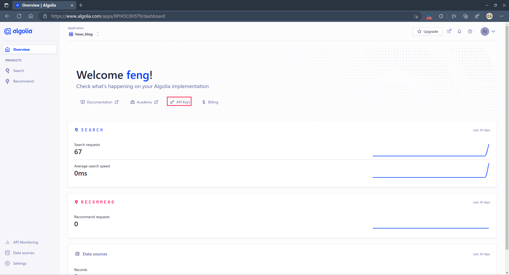
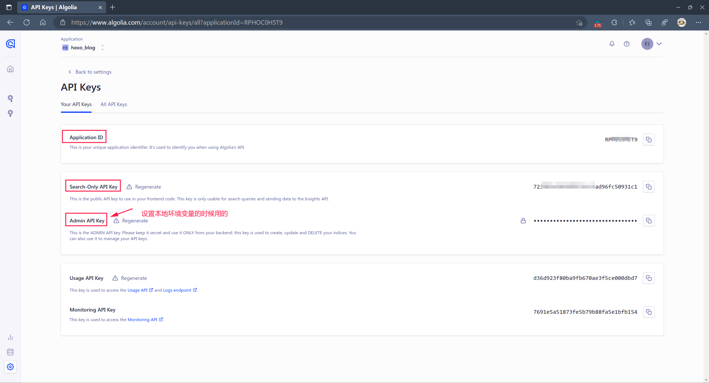

## 遇到的问题

我在配置搜索服务时，遇到的问题是在执行``` hexo algolia```命令时报如下信息，好像我没有安装插件一样，但实际我是安装了的，最后折腾才发现，我安装该搜索服务时，是没有在我博客根目录执行安装命令，而是随便在其他目录下安装执行的，也不知道为何有这个问题，随后在根目录下再次安装就好了。

```bash
babyfengfjx@babyfengfjx:~/Documents/typora_documents/github/workdata/myblog$ hexo algolia
INFO  Validating config
Usage: hexo <command>

Commands:
  clean     Remove generated files and cache.
  config    Get or set configurations.
  deploy    Deploy your website.
  generate  Generate static files.
  help      Get help on a command.
  init      Create a new Hexo folder.
  list      List the information of the site
  migrate   Migrate your site from other system to Hexo.
  new       Create a new post.
  publish   Moves a draft post from _drafts to _posts folder.
  render    Render files with renderer plugins.
  server    Start the server.
  version   Display version information.

Global Options:
  --config  Specify config file instead of using _config.yml
  --cwd     Specify the CWD
  --debug   Display all verbose messages in the terminal
  --draft   Display draft posts
  --safe    Disable all plugins and scripts
  --silent  Hide output on console

For more help, you can use 'hexo help [command]' for the detailed information
or you can check the docs: http://hexo.io/docs/
```

# 配置步骤

## Step1:注册algolia

[访问此处进行注册登录](https://www.algolia.com/)

## Step2:创建索引数据库

> 按照如下图进行索引实例创建即可，这里的索引名称后面会用到，自行创建记住即可。



## Step3：查看API信息

> 可能很多人不知道具体在哪里看，当前可以查看的路径可以看如下截图。







## Step4:安装插件配置本地文件

- 先进入自己博客项目的根目录，然后安装插件：``` npm install --save hexo-algolia```;

- 然后在hexo根目录下的主配置文件```_config.yml```添加如下内容（具体值按照自己实际注册的内容填写即可）:

  ```bash
  algolia:
    applicationID: 'RPHOC0xxxx'
    apiKey: '723903e5de5899f6cc4ad96fc509xxxx'
    adminApiKey: 'fe4c456ceeaea4f264f0d242b5fexxxx'
    indexName: 'hexo_blog'
    chunkSize: 5000
  ```

- 再在你的主题配置文件中开启相关功能配置：

  ```bash
  algolia_search:
    enable: true # or false
    hits:
      per_page: 10 # the number of search results per page
    labels:
      input_placeholder: Search for Posts
      hits_empty: "We didn't find any results for the search: ${query}" # if there are no result
      hits_stats: "${hits} results found in ${time} ms"
  ```

## Step5：更新数据到algolia服务器

在 hexo 站点根目录下执行`hexo algolia` 来搜集数据更新到我们刚创建的 Index 中

此时执行上述命令一般会报如下错误：(这里就是上面说的我们还有一个本地环境变量没配置)

```bash
babyfengfjx@babyfengfjx:~/Documents/typora_documents/github/workdata/myblog$ hexo algolia
INFO  Validating config
ERROR [hexo-algolia] Please set an `HEXO_ALGOLIA_INDEXING_KEY` environment variable to enable content indexing.
ERROR >> Read https://npmjs.com/hexo-algolia#api-key for more informations.
```

直接执行一下如下命令：```export HEXO_ALGOLIA_INDEXING_KEY=fe4c456ceeaea4f264f0d242b5fexxxx``` 其中这个key就是Admin api key，添加完环境变量后，再次执行上述命令即可。

## Step6：重新部署即可

```bash
hexo clean
hexo g
hexo d
```


